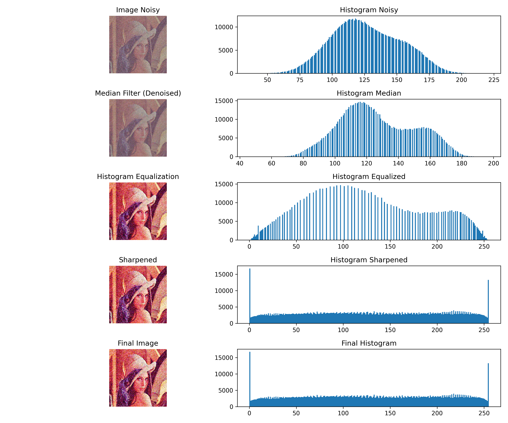

# Mini Project 1 Image Restoration

**Nama :** Azfarafi Gustiar Jati

**NRP :** 5024241037

---

## Deskripsi Singkat

Project ini bertujuan untuk melakukan **restorasi citra** dari gambar yang telah mengalami noise (kerusakan), menggunakan pendekatan manual berbasis **NumPy** tanpa memanfaatkan fungsi processing dari OpenCV.

Citra yang digunakan adalah `lena_noisy.png`, dan hasil akhirnya disimpan sebagai `lena_restored.png`.

---

## Library yang Digunakan

* `numpy` → operasi pengolahan citra (filtering, histogram, transformasi)
* `cv2` → membaca dan menyimpan citra
* `matplotlib` → visualisasi histogram dan perbandingan gambar

---

## Pipeline Restorasi

### 1. Denoising (Median Filter)

* Menggunakan **median filter 5x5 manual**
* Dilakukan dengan padding `reflect`
* Setiap pixel diganti dengan nilai median dari tetangganya

**Tujuan:**
Menghilangkan noise terutama **salt-and-pepper noise**


### 2. Histogram Equalization (Manual)

* Menghitung histogram menggunakan `np.bincount`
* Menghitung CDF (Cumulative Distribution Function)
* Normalisasi ke range 0–255
* Membuat LUT (Look-Up Table)
* Mapping ulang nilai pixel

**Tujuan:**
Meningkatkan kontras citra


### 3. Sharpening (Kernel Manual)

* Menggunakan kernel:

```
[ 0 -1  0 ]
[-1  5 -1]
[ 0 -1  0 ]
```

* Dilakukan dengan konvolusi manual (loop + padding)

**Tujuan:**
Mempertajam detail yang sebelumnya blur akibat proses denoising

---

## Hasil Visualisasi

### Perbandingan Pipeline

Gambar berikut menunjukkan:

* Citra asli (noisy)
* Hasil median filter
* Hasil histogram equalization
* Hasil sharpening
* Histogram masing-masing tahap



### Perbandingan Sebelum vs Sesudah

| Sebelum (Noisy)           | Sesudah (Restored)            |
| ------------------------- | ----------------------------- |
|  |  |


## Analisis Singkat

### Yang Berhasil

* **Median filter** yang diimplementasikan secara manual dengan kernel 5x5 mampu mengurangi noise, khususnya salt-and-pepper noise, dengan cukup efektif karena setiap pixel diganti dengan nilai median dari tetangganya sehingga outlier dapat dihilangkan tanpa terlalu merusak struktur utama citra.
* **Histogram equalization** yang dilakukan menggunakan perhitungan histogram, CDF, dan LUT berhasil meningkatkan kontras citra secara signifikan, terlihat dari distribusi intensitas yang menjadi lebih merata dibandingkan citra awal.
* **Sharpening** menggunakan kernel sederhana berhasil mempertegas tepi dan detail yang sebelumnya sedikit blur akibat proses denoising, sehingga hasil akhir terlihat lebih jelas dan tajam.

### Yang Bisa Ditingkatkan

* Penggunaan median filter dengan ukuran kernel 5x5 menyebabkan beberapa detail halus ikut hilang sehingga citra menjadi sedikit blur.
* Histogram equalization yang bersifat global membuat peningkatan kontras tidak merata pada semua bagian citra dan dapat menyebabkan beberapa area terlalu terang atau gelap.
* Proses sharpening berpotensi memperkuat sisa noise yang masih ada sehingga hasil akhir bisa terlihat kurang natural pada bagian tertentu.


## Cara Menjalankan Program

1. Pastikan struktur folder:

```
mp1-image-restoration/
├── restoration.py
├── input/
│   └── lena_noisy.png
└── output/
```

2. Install library:

```bash
pip install numpy opencv-python matplotlib
```

3. Jalankan program:

```bash
python restoration.py
```

4. Output:

* `output/lena_restored.png`
* `output/visualisasi_pipeline.png`

---


